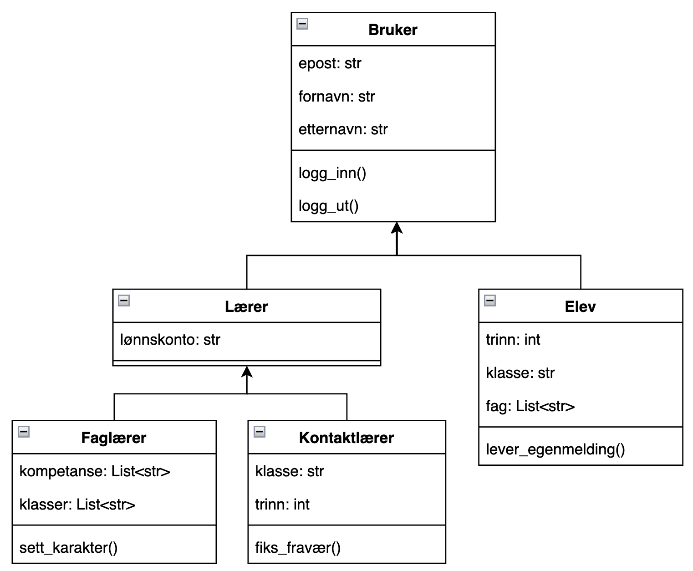

# Arv

Arv består av en superklasse og en subklasse der subklassen tar fra superklassen.

## eksemeplprojekt

## Bruk i større prosjekt

- [Hoppespill](https://github.com/Jensbjorgo/IT2-bigmppe/tree/main/pygame/hoppespillet)

## Eksempel 2
her brukes det arv til å lage biletter av forskjellige slag. Du har en Superklasse bilett som underklassene låner hovedfunksjonene fra og legger sin egen vri på.

- [Bilettprogram](https://github.com/Jensbjorgo/IT2-bigmppe/tree/main/2.problemløsning/arv/bilett.py)

## Eksempel 3
Her brukes det arv til å lage en terning og en jukseterning som låner funksjonene til den vanlige terningen.

- [Terningprogram](https://github.com/Jensbjorgo/IT2-bigmppe/tree/main/2.problemløsning/arv/terning.py)
