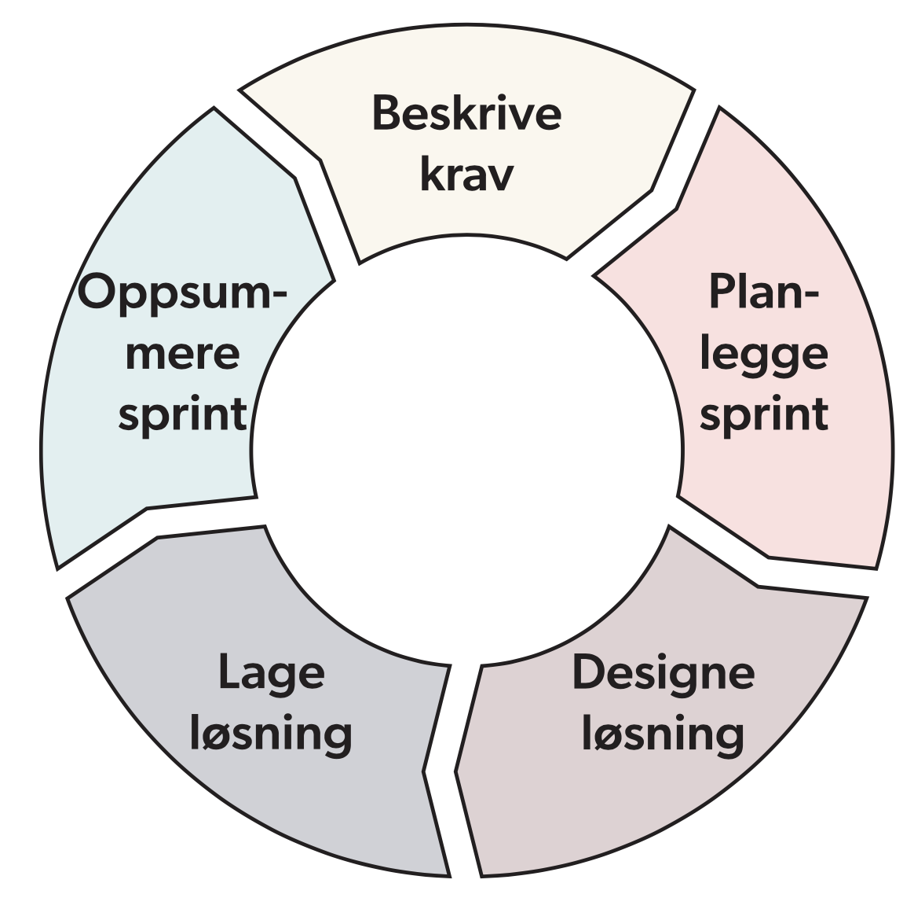
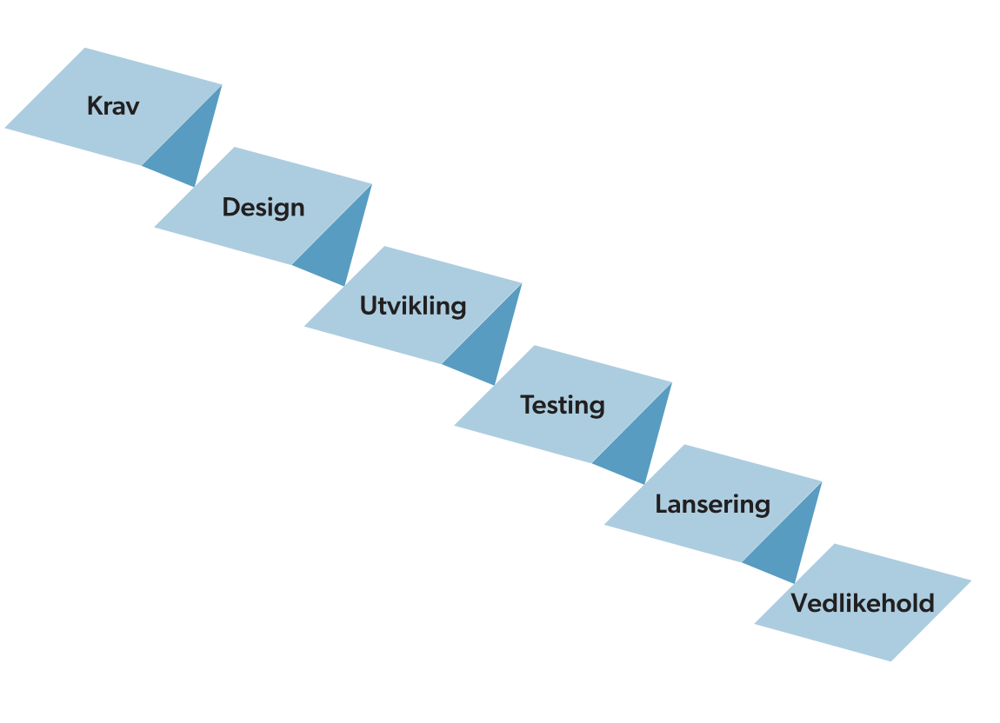

# Metoder teknikker og verktøy

## Smidig metodikk
Smidig metododikk er syklisk og har flere "sprinter" der man følger en slik syklus:
beskrive krav
planlegge sprint
designe løsning
lage løsning
oppsummere sprint
beskrive krav...
...

## Fossefallsmetoden
Alt er planlagt i forveien og man går ett og ett steg nedover i denne rekkefølgen:
Krav: Kravene til programvaren beskrives. Hvilke konkrete problemer skal programvaren løse?
Design: Programvaren planlegges.
Utvikling: Programvaren utvikles.
Testing: Programvaren testes.
Lansering: Programvaren er godkjent og kan lanseres.
Vedlikehold: Programvaren vedlikeholdes. Feil rettes opp o.l.

## Testdrevet utvikling
Man skriver først en ønsket funksjonalitet. Deretter skriver man koden og tester at den funker som planlagt. Det bidrar til å sikre koden ved ofte testing og eventuelle feil blir oppdaget fort og lett og finne hvor feilen ligger. 