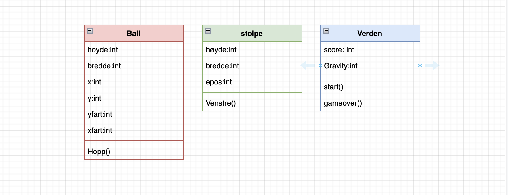
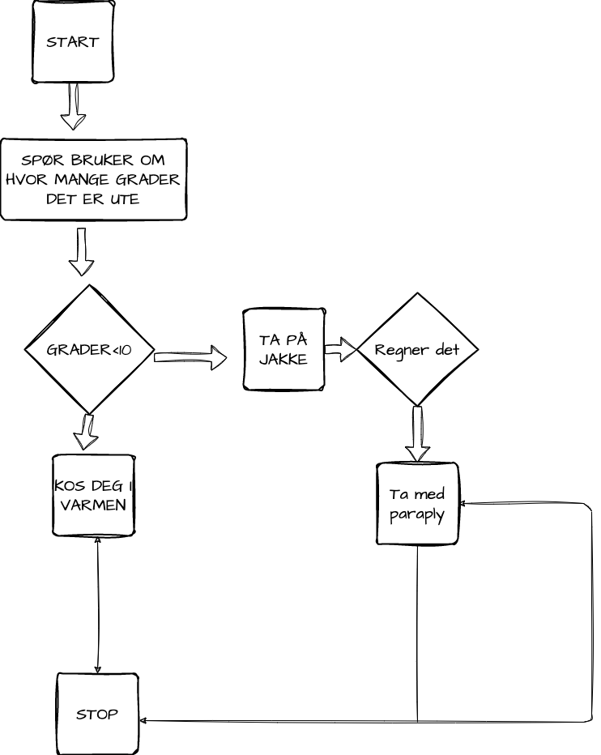
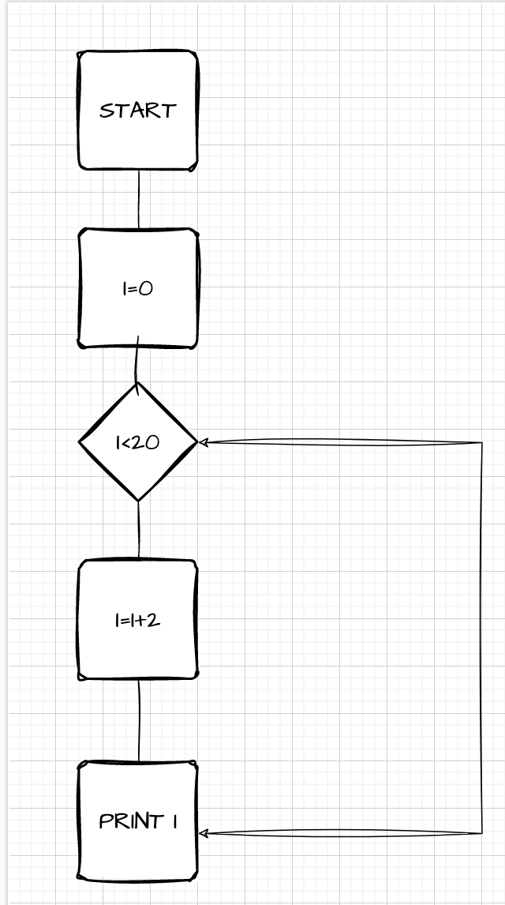

# UML-Diagrammer

UML-diagrammer brukes for å gi en oversikt og plan til et objektorientert python prosjekt. Du kan tegne for hånd eller bruke en nettside som diagrams.net. 

# Flyt-diagrammer

Brukes til å visualiere en arbeidsprosses for å gjøre det lettere å holde oversikt. Brukes som oftest på enkle program og er veldig bra for å visualsiere valg og "if or else"- setninger.

## Eksempler

